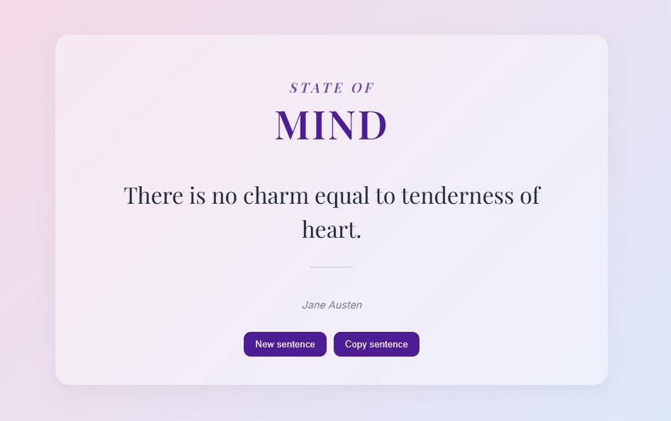

# StateOfMind — Random Quotes App

Este projeto é uma aplicação web para exibição de **frases inspiradoras aleatórias**, consumidas de uma API externa.

O foco foi desenvolver uma interface **moderna, minimalista e interativa**, aplicando conceitos fundamentais de React como **useState, useEfect e consumo de API**, além de atenção especial à experiência do usuário.

---

## 📸 Preview

---

## 🎯 Objetivo do Projeto

Criar uma aplicação simples, porém bem estruturada, para consolidar conceitos essenciais de **React**, incluindo:

- Consumo de API com `fetch`
- Gerenciamento de estado com `useState`
- Efeitos colaterais com `useEffect`
- Atualização dinâmica da interface
- Microinterações e feedback visual

---

## 🛠️ Tecnologias Utilizadas

- **React.js (Vite)**
- **JavaScript (ES6+)**
- **CSS3**
  - Flexbox
  - Responsividade com Media Queries
- **API REST (Quotable API)**

---

## 📚 Possíveis Melhorias Futuras

- Adicionar animações mais avançadas (ex: Framer Motion)
- Implementar modo escuro (dark mode)
- Persistência da última frase (localStorage)
- Adicionar categorias de frases
- Criar versão com TypeScript
- Melhorar acessibilidade (ARIA, navegação por teclado)

---

## 🔗 Links

- 🌐 **API utilizada (Quotable)**  
  https://api.quotable.io

- 💻 **Link do projeto**  
  https://estefpimenta.github.io/stateOfMind/

---
